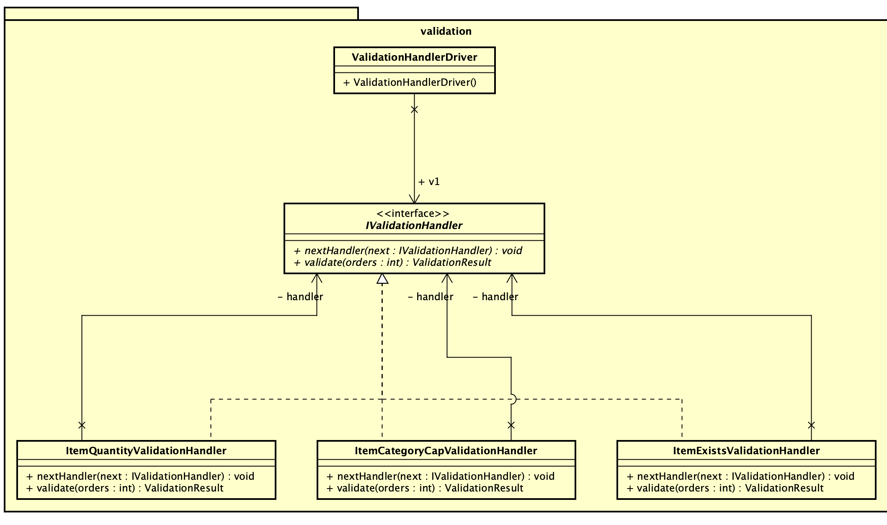

## CMPE 202 Individual Project - Billing Management

Anjali Jain - 015244151 

### Steps to run the application :
- Prerequisite : Apache Maven 3.8.5,java version "11.0.12"
- Clone the source code 
- Run the below commands
   - cd billingmanagement 
   - mvn clean compile install
   - mvn exec:java -Dexec.mainClass=com.sjsu.billing.Billing
- It will ask for input file & output path location. Provide the necessary details

### Brief Introduction
The application maintains an internal, static database (inventory of stock & card numbers)(developed using hashmap data structure). Everytime we re-run the program, the database will revert to its original state. The program will read an input csv file containing order details like items, quantity needed & payment card number. The program will perform certain validations as per the requirement. After these validations, if the cart is valid, prices for the cart will be calculated. If the card number of the user is not present in the database, it will be added. Final output will be a csv file (output.csv) containing total amount paid.
If the validations are not successful, an output.txt file will be generated with the failed validation details. 
Chain of Responsibility, Singleton and Strategy design pattern is used for the implementation.

### Design Patterns
#### 1. Singleton
Singleton is a creational design pattern that lets you ensure that a class has only one instance, while providing a global access point to this instance. This design pattern is implemented to maintain a static inventory database. The constructor of this singleton class is made private to avoid object instantiation. There is a single instance of this class inside the JVM. All the modifications will happen to that single instance. Once the program is rerun, the database will restore its initial state i.e no older changes will be persisted. The implementation of the singleton class is thread safe.
 

#### 2. Chain of Responsibility
This pattern is used to perform validations in a step-by-step way. 
1. Validate if the item exists in the database
2. Validate if the requested quantity for each item is permissible
3. Validate if the total quantity of each category in one order matches the configured cap limit.
The request is being passed to the chain of validation handlers. Each validation handler will decide whether to pass the request to the next validation handler or generate an error file.
 

#### 3. Factory Design Pattern
Factory Method is a creational design pattern that uses factory methods to deal with the problem of creating objects without having to specify the exact class of the object that will be created. This design pattern is used to create the final output file. If there are validation errors, an object of defaultFileWriter will be returned. If there are no validation errors, the object of csvfilewriter will be returned. 

 

### Class Diagram
 
### Testing and output screenshots
##### TestCase 1 : The input file is valid.
 
 ##### TestCase 2 : Invalid item that does not exist in our inventory database is present in the input file. 
 
 ##### TestCase 3 : Quantity requested is more than quantity available.
 
 ##### TestCase 4 : No of items in a particular category exceeds the configured category cap.
 
